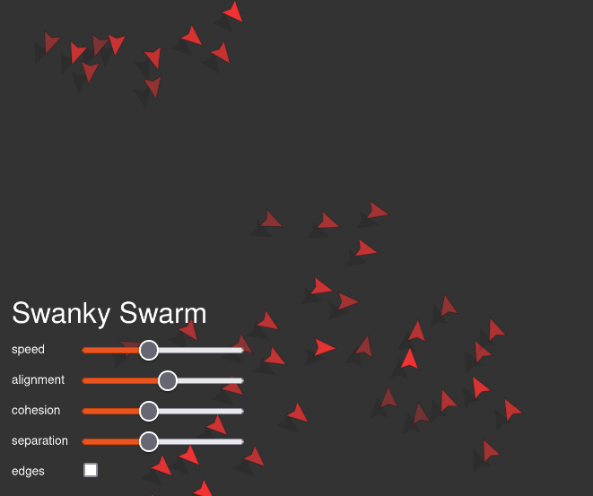
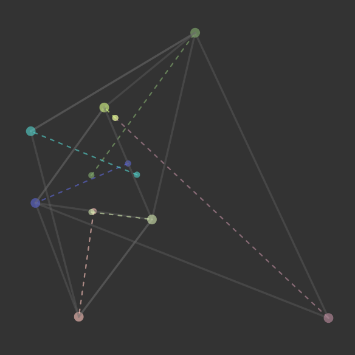
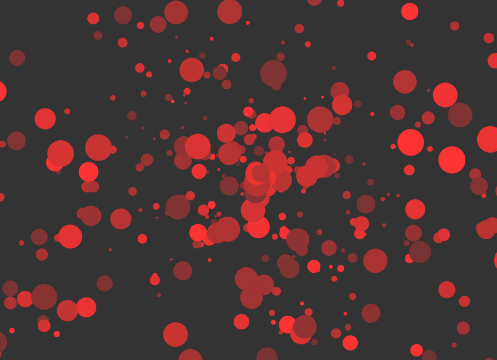

## 1. Swanky Swarm - A swarm simulator

How can you simulate a swarm fish or birds computationally? This is the question which [Craig W. Reynolds](https://en.wikipedia.org/wiki/Craig_Reynolds_(computer_graphics)) examined in 1986. He suggested three rules which the objects should obey: 1. alignment, 2. cohesion and 3. separation. 

Reynolds' algorithm has been used in many swarm of simulations, including in films like [Batman Returns](https://en.wikipedia.org/wiki/Batman_Returns) (1992). In 1988 Reynolds won the Academy Scientific and Technical Award for "his pioneering contributions to the development of three-dimensional computer animation for motion picture production."

This javascript based implementation of the swarm simulation has been created based on a [video](https://www.youtube.com/watch?v=mhjuuHl6qHM) of Daniel Shiffman.

[Go to simulation](swanky_swarm.html)

## 2. The triangle game

This simulation is based on a small offline game which can be played in groups of 5-30 people in an area with enough space like a garden or a yard. The rules are simple: Before the actual game starts, each person has to think of two other people. Then the game starts, talking is not allowed. Everyone is now supposed to go to the spot where the two people form a triangle and in an angle of 90 degrees to oneself.

I wanted to find out computationally which kind of behaviour emerges from this rules. Is there a numerical solution to such a game? And does it arise in every game, or just in some? The parameters allow to find out and play with this.

[Go to simulation]((triangle_game.html))

## 3. What's that? A star sky? Just colours?

I don't know. Just here, because it looks nice: [Red universe](universe.html)

## 4. Deal or no deal (currently not working properly)

As part of a small team, I developed this game in November 2021: [Deal or no deal](deal_or_no_deal/index.html).

Unfortunately, it is not loaded properly on this website. 

